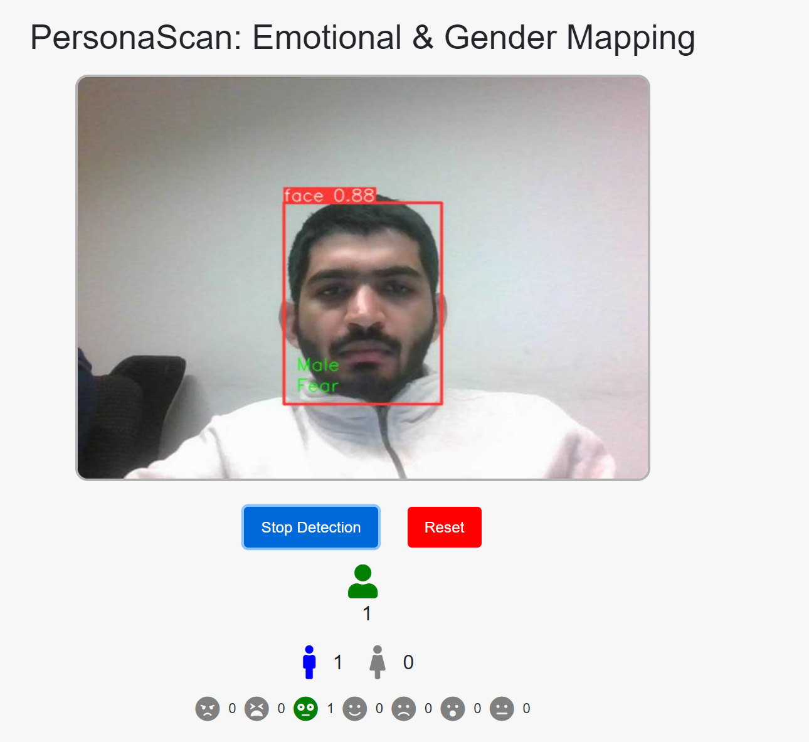

# Sentimask

## Overview
Sentimask is a Django-based web application designed for real-time face mask detection. Utilizing the YOLOv5 model, it provides fast and accurate detection capabilities. This project integrates with a SQLite database for data management, making it suitable for deployment in environments where face mask compliance needs to be monitored.

## Features
- **Real-time Mask Detection**: Leveraging the YOLOv5 object detection model for high accuracy and performance.
- **Data Management**: Integrated with SQLite for efficient data storage and retrieval.
- **Web Application**: Built with Django, offering a robust framework for web applications.

## Installation

### Prerequisites
- Python 3.8+
- Django 3.2+
- YOLOv5 dependencies

### Setup
1. Clone the repository and its submodules using the following command:

    ```shell
    git clone <repository-url> --recurse-submodules
    ```

2. Navigate to the project directory:

    ```shell
    cd Sentimask
    ```

3. Install dependencies:

    ```shell
    pip install -r requirements.txt
    ```

4. Migrate the database:

    ```shell
    python manage.py migrate
    ```

5. Run the server:

    ```shell
    python manage.py runserver
    ```

Access the web application at `http://localhost:8000`.

## Usage

To use the Sentimask application, follow these steps:

1. Start the application server on your local machine.

2. Open your web browser and navigate to `http://localhost:8080`.

3. Allow the application to access your webcam when prompted for camera permissions.

4. The application will display a live video feed from your webcam. Click on start detection to detect faces within the live video and click on stop button to stop live inference.

5. When a face is detected, the model will analyze and display the detected gender (Male/Female) and emotion (such as Angry, Disgust, Fear, Happy, Sad, Surprise, Neutral).

6. The analysis results are displayed directly on the video feed, with a bounding box drawn around each detected face. Inside this box, you will see the confidence level of the face detection (e.g., "face 0.88" suggests an 88% confidence in the face detection), the predicted gender, and the predicted emotion.

7. Below the video feed, you will find a control panel with various icons:

    - **Human Figure**: Indicates the number of faces detected in the frame.
    - **Gender Icons (Male/Female)**: Shows the gender prediction for the detected face.
    - **Emotion Icons**: Correspond to the different emotions the system can recognize. These icons will highlight or change based on the detected emotion of the face in the video feed.

8. The application also provides buttons to 'Stop Detection' or 'Reset' the detection process.

For example, as seen in the attached screenshot, the application has detected one face with a high confidence level. It has identified the gender as Male and the emotion as Fear. The corresponding icons in the control panel reflect this detection. You can interact with the application in real-time, and it will update the detection as the subject's facial expressions change or as new faces come into view.




Remember to ensure good lighting and clear visibility of the face for optimal detection performance. Enjoy exploring the different features and capabilities of the PersonaScan application!


## Contributing
Contributions to Sentimask are welcome! Please read the contributing guidelines before submitting pull requests.

## License
Specify the license under which the project is made available.

## Acknowledgements
- YOLOv5 for the object detection model.
- Django for the web application framework.
